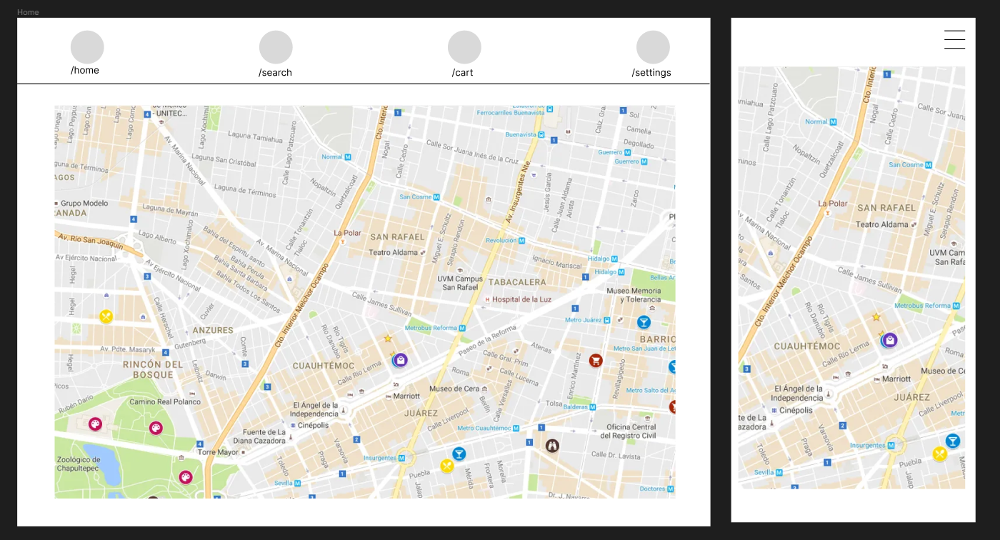
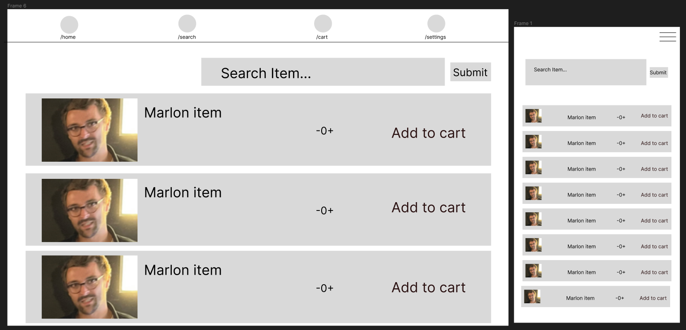
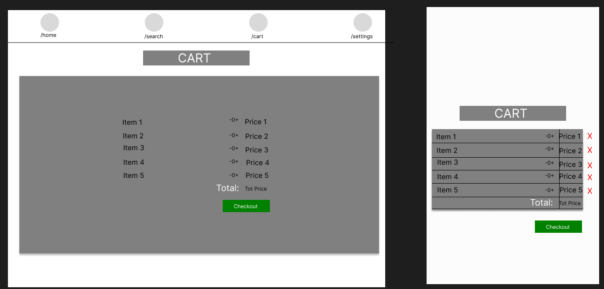
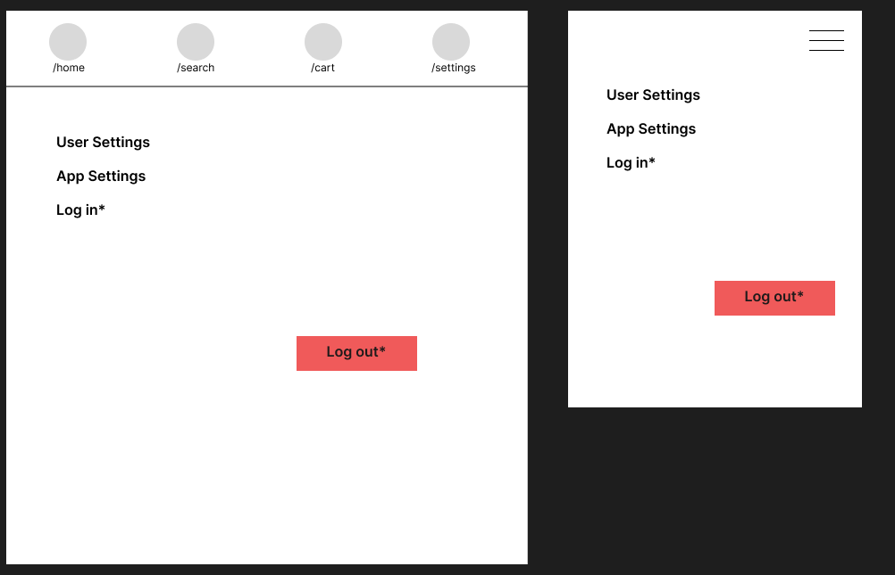
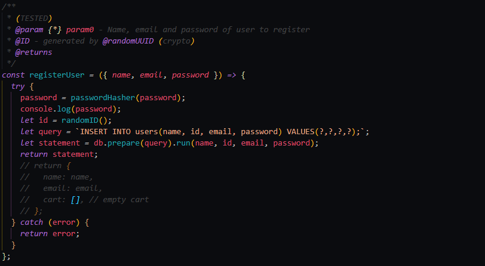

## <em>Setup backend<em>

> `pwd: Nordics-Team`
>
> `cd /backend`
>
> `npm install`

## <em>Setup Frontend<em>

> `pwd: Nordics-Team`
>
> `cd /frontend`
>
> `npm install`

## _WireFrame_

> ### _Home page_ (Webview & Mobile)
>
> 
>
> ### _Search page_ (Webview & Mobile)
>
> 
>
> ### _Cart page_ (Webview & Mobile)
>
> 
>
> ### _Settings page_ (Webview & Mobile)
>
> 

## _Exposed API routes_;

> | Routes(Endpoint)                          | Description                                       | Method | Request data                     |
> | ----------------------------------------- | ------------------------------------------------- | ------ | -------------------------------- |
> | /api/users/register                       | Add new user                                      | POST   | {email, name, password}          |
> | /api/users/login                          | Login                                             | POST   | {email, password}                |
> | /api/users/cart                           | Add product to cart                               | POST   | {email, product_ID, user_ID, Q } |
> | /api/users/cart/:email                    | Get user's cart                                   | GET    |                                  |
> | /api/users/cart/remove/:product_ID/:email | Remove item from user's cart                      | DELETE |                                  |
> | /api/users/cart/clear/:email              | Clear user's cart                                 | DELETE |                                  |
> | /api/products/                            | Get all products                                  | GET    |                                  |
> | /api/products/getProductByNameAndID       | Get a specific product                            | GET    | {:name, :ID}                     |
> | /api/products/search/:term                | Search for product, by section or name _(filter)_ | GET    | {:term}                          |

## _API services_

> All routes exposed by the API are handled by its respective service function via its respective controller function and script.
> 
>
> <figcaption>Services example to register new users</figcaption>

## _Technology stack_

> | Name                                                | Use                         |
> | --------------------------------------------------- | --------------------------- |
> | [Node js](https://nodejs.org/en/)                   | API development             |
> | [Express Js](https://www.npmjs.com/package/express) | API development Framework   |
> | [React JS](https://reactjs.org/)                    | Frontend Development        |
> | [Sqlite](https://www.sqlite.org/index.html)         | Locally hosted SQL database |

## _Development dependencies_

> | Name                                                             | Use                                       |
> | ---------------------------------------------------------------- | ----------------------------------------- |
> | [cors](https://www.npmjs.com/package/cors)                       | Node.js middleware to handle cors options |
> | [better-sqlite3](https://www.npmjs.com/package/better-sqlite3)   | Sqlite library                            |
> | [dotenv](https://www.npmjs.com/package/dotenv)                   | Save and local env varaibles              |
> | [bcrypt](https://www.npmjs.com/package/bcrypt)                   | Hashing and password validation           |
> | [axios](https://www.npmjs.com/package/axios)                     | Promise based library for HTTP API calls  |
> | [bootstrap](https://www.npmjs.com/package/bootstrap)             | Stylizing                                 |
> | [react-bootstrap](https://www.npmjs.com/package/react-bootstrap) | Stylizing                                 |
> | [react-router](https://github.com/remix-run/react-router)        | Declaritive routing with react            |

### _Project board_

> [Trello board](https://trello.com/invite/b/RGnhvL5z/3c26943152807981dca96904aa77f50b/nordics-team-dev)
